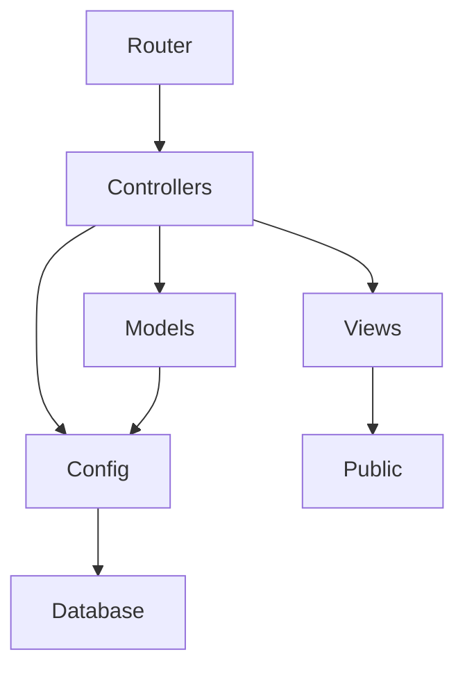

## 1. Stack
- PHP 8, no framework, hand-rolled MVC — README.md L8
- MySQL 5.7+ / MariaDB — README.md L9
- Vanilla JavaScript, no build step — README.md L10
- Single CSS file, custom theme — README.md L11
- PDO prepared statements; passwords via `password_hash`/`password_verify` — README.md L100-101

## 2. Directory map
| path | what lives there |
|---|---|
| MVC/ | app root — front controller + all app code |
| MVC/config | db.php, session.php, helpers.php |
| MVC/controllers | route handlers, grouped: auth, admin, home, restaurants, menu, profile, foodexperience, api |
| MVC/models | one PHP class per table: FoodComment, FoodPost, MenuItem, Restaurant, RestaurantReview, Review, User |
| MVC/views | PHP view templates: admin, auth, foodexperience, home, layouts, menu, profile, restaurants |
| MVC/public | css/style.css, js/*.js, images/, uploads/menu, uploads/profiles |
| MVC/database | schema.sql (shared, do not modify), seed.sql |

## 3. Diagram

## 4. Component index
- [[Router]]
- [[Controllers]]
- [[Models]]
- [[Views]]
- [[Config]]
- [[Database]]
- [[Public]]

## 5. Entry points
- Dev (PHP built-in server): `cd MVC && php -S localhost:8000` — README.md L73-76
- Dev (Docker): `docker compose up -d --build`, open http://localhost:8080/ — README.md L44-47
- Prod (Apache/XAMPP/MAMP): DocumentRoot -> `MVC/` so `.htaccess` is honored — README.md L79-80
- Front controller (exact path): `MVC/index.php`

## 6. Conventions
- All requests flow through `MVC/index.php`, dispatched on `$_GET['route']` via if/elseif with regex for id-bearing routes — MVC/index.php L8-172
- Route-to-file mapping is literal: e.g. `admin/restaurants/edit/(\d+)` -> `controllers/admin/restaurants_form.php` with `$_GET['id']` set from the match — MVC/index.php L80-83
- Unmatched routes fall through to a 404 branch that renders `views/layouts/header.php` / `footer.php` directly — MVC/index.php L174-180
- `public/...` static asset requests are served by index.php itself (with a manual ext->Content-Type map) when running under `php -S` — MVC/index.php L11-26
- Config bootstrap order in the front controller: helpers.php, then db.php, then session.php — MVC/index.php L4-6

## 7. Where things go
- New public page: add controller file under `MVC/controllers/<area>/`, add matching view under `MVC/views/<area>/`, add a route branch in `MVC/index.php`
- New admin CRUD entity: controller(s) in `MVC/controllers/admin/`, model in `MVC/models/`, views in `MVC/views/admin/`, routes in `MVC/index.php`
- New AJAX/JSON endpoint: controller file in `MVC/controllers/api/`, route branch in `MVC/index.php` (see `api/*` branches)
- New DB table: add to `MVC/database/schema.sql`, add a corresponding model class in `MVC/models/`
- New static asset: place under `MVC/public/css` | `MVC/public/js` | `MVC/public/images`, reference from a view in `MVC/views/`
